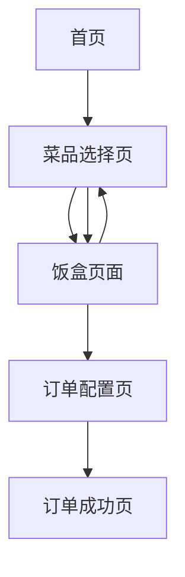

# 社区小饭桌订餐系统产品需求文档

## 1. 产品概述
社区小饭桌是一个便民订餐网页应用，为社区居民提供便捷的在线订餐服务。用户可以选择各类菜品、甜点、水果和饮品，自由搭配个人专属饭盒，并选择合适的配送时间和地址完成订单。

产品旨在解决社区居民日常用餐需求，提供健康营养的餐食选择，通过直观易用的界面设计提升用户订餐体验。

## 2. 核心功能

### 2.1 用户角色
本产品采用单一用户角色设计，无需复杂的权限管理：

| 角色 | 注册方式 | 核心权限 |
|------|----------|----------|
| 默认用户 | 无需注册，直接使用 | 可浏览菜品、添加到饭盒、下单配送 |

### 2.2 功能模块
我们的社区小饭桌订餐系统包含以下主要页面：
1. **首页**：品牌展示、菜品分类导航、热门推荐
2. **菜品选择页**：菜品展示、分类筛选、添加到饭盒
3. **饭盒页面**：查看已选菜品、数量调整、价格计算
4. **订单配置页**：配送时间选择、地址填写、订单确认
5. **订单成功页**：制作动画、成功提示、用餐祝福

### 2.3 页面详情

| 页面名称 | 模块名称 | 功能描述 |
|----------|----------|----------|
| 首页 | 品牌展示区 | 展示社区小饭桌品牌logo、slogan和主要特色 |
| 首页 | 分类导航 | 提供菜品、甜点、水果、饮品等分类快速入口 |
| 首页 | 热门推荐 | 展示当日特色菜品和热门搭配推荐 |
| 菜品选择页 | 分类筛选 | 按菜品类型（主菜、甜点、水果、饮品）进行筛选 |
| 菜品选择页 | 菜品展示 | 显示菜品图片、名称、价格、营养信息和添加按钮 |
| 菜品选择页 | 饭盒预览 | 实时显示已选菜品数量和总价格 |
| 饭盒页面 | 菜品列表 | 展示已选择的所有菜品，包含图片、名称、单价 |
| 饭盒页面 | 数量调整 | 提供增减按钮调整每个菜品的数量 |
| 饭盒页面 | 价格计算 | 实时计算并显示总价格和优惠信息 |
| 订单配置页 | 时间选择 | 选择配送日期和用餐时段（午餐/晚餐） |
| 订单配置页 | 地址填写 | 输入详细的配送地址信息 |
| 订单配置页 | 订单确认 | 显示订单摘要，确认下单按钮 |
| 订单成功页 | 制作动画 | 播放"正在制作中..."的动态效果 |
| 订单成功页 | 成功提示 | 显示订单号和预计送达时间 |
| 订单成功页 | 用餐祝福 | 展示"祝你用餐愉快！"等温馨提示 |

## 3. 核心流程

用户使用流程：
1. 用户访问首页，浏览品牌介绍和热门推荐
2. 点击分类导航进入菜品选择页面
3. 浏览各类菜品，点击添加按钮将心仪菜品加入饭盒
4. 查看饭盒页面，调整菜品数量，确认选择
5. 进入订单配置页面，选择配送时间和填写地址
6. 确认订单信息并提交
7. 跳转到订单成功页面，观看制作动画并收到用餐祝福

## 4. 用户界面设计

### 4.1 设计风格
- **主色调**：温暖橙色(#FF6B35)作为主色，代表食物的温暖和活力
- **辅助色**：清新绿色(#4CAF50)作为辅助色，象征健康和新鲜
- **按钮样式**：圆角矩形按钮，具有轻微阴影效果，提供良好的点击反馈
- **字体**：主标题使用18-24px粗体，正文使用14-16px常规字体，确保清晰易读
- **布局风格**：卡片式布局，顶部导航栏设计，内容区域采用网格布局
- **图标风格**：使用简洁的线性图标和食物相关的emoji表情，增加亲和力

### 4.2 页面设计概览

| 页面名称 | 模块名称 | UI元素 |
|----------|----------|--------|
| 首页 | 品牌展示区 | 大尺寸logo、渐变背景、温馨标语文字 |
| 首页 | 分类导航 | 四个圆形图标按钮，配有食物emoji和分类名称 |
| 首页 | 热门推荐 | 横向滑动卡片，包含菜品图片、名称和价格 |
| 菜品选择页 | 分类筛选 | 顶部标签栏，选中状态使用主色调高亮 |
| 菜品选择页 | 菜品展示 | 网格布局卡片，圆角图片、价格标签、添加按钮 |
| 饭盒页面 | 菜品列表 | 列表式布局，左侧图片、中间信息、右侧数量控制 |
| 饭盒页面 | 价格计算 | 底部固定区域，大字体显示总价，醒目的结算按钮 |
| 订单配置页 | 时间选择 | 日期选择器和午/晚餐单选按钮组 |
| 订单配置页 | 地址填写 | 多行文本输入框，带有地址图标 |
| 订单成功页 | 制作动画 | 旋转的厨师帽图标，配合"制作中..."文字动效 |
| 订单成功页 | 用餐祝福 | 大字体祝福语，配有庆祝emoji和温暖背景色 |

### 4.3 响应式设计
产品采用移动端优先的响应式设计，主要针对手机端用户体验进行优化，同时兼容平板和桌面端访问。支持触摸交互优化，包括合适的按钮尺寸和手势操作。